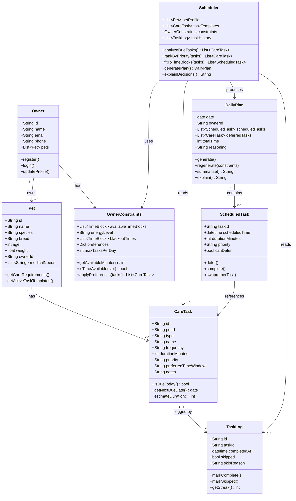

# PawPal+ Project Reflection

## 1. System Design

- Add a pet
- Schedule a walk
- See today's tasks
- Check finished tasks

**a. Initial design**

My initial design centered on separating **data** (what exists) from **logic** (what decides). I identified 8 classes organized around the core loop: an owner has pets, pets have tasks, tasks get scheduled into a daily plan.

The classes and their responsibilities:

- **Owner** — stores profile info and links to their pets
- **Pet** — holds pet details and medical needs; knows what care it requires
- **CareTask** — a reusable task template (e.g. "daily walk, 30 min, high priority"); knows if it's due today
- **TaskLog** — records each completed or skipped instance of a task; tracks streaks and history
- **OwnerConstraints** — captures the owner's available time blocks, energy level, and preferences for a given day
- **Scheduler** — the planning brain; reads due tasks, task history, and constraints, then produces a ranked, time-fitted plan
- **DailyPlan** — the output: an ordered list of scheduled tasks, a deferred list, and a plain-English reasoning string
- **ScheduledTask** — a CareTask placed at a specific time slot within the plan

**b. Design changes**

- Did your design change during implementation?
- If yes, describe at least one change and why you made it.

---

## 2. Scheduling Logic and Tradeoffs

**a. Constraints and priorities**

- What constraints does your scheduler consider (for example: time, priority, preferences)?
- How did you decide which constraints mattered most?

**b. Tradeoffs**

- Describe one tradeoff your scheduler makes.
- Why is that tradeoff reasonable for this scenario?

---

## 3. AI Collaboration

**a. How you used AI**

- How did you use AI tools during this project (for example: design brainstorming, debugging, refactoring)?
- What kinds of prompts or questions were most helpful?

**b. Judgment and verification**

- Describe one moment where you did not accept an AI suggestion as-is.
- How did you evaluate or verify what the AI suggested?

---

## 4. Testing and Verification

**a. What you tested**

- What behaviors did you test?
- Why were these tests important?

**b. Confidence**

- How confident are you that your scheduler works correctly?
- What edge cases would you test next if you had more time?

---

## 5. Reflection

**a. What went well**

- What part of this project are you most satisfied with?

**b. What you would improve**

- If you had another iteration, what would you improve or redesign?

**c. Key takeaway**

- What is one important thing you learned about designing systems or working with AI on this project?
